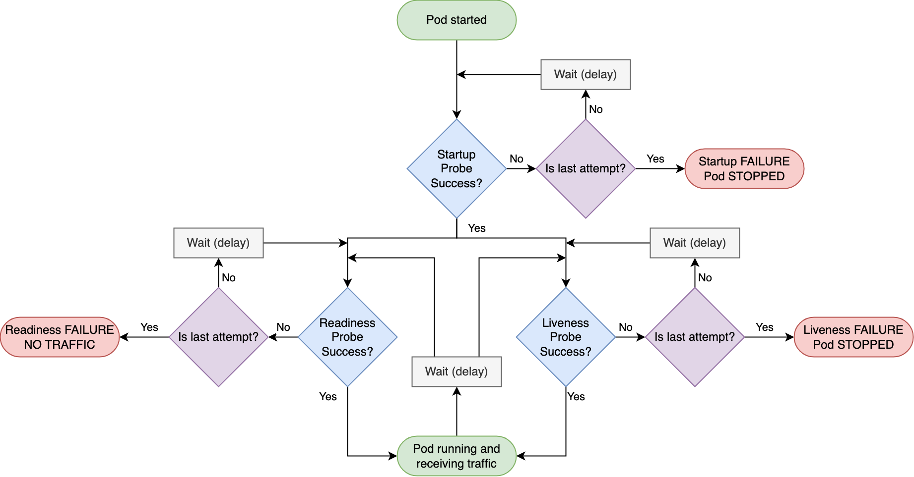

category:: Kubernetes
type:: #K8s, #Monitoring
alias:: K8s - Monitoring

- **流程**
- {:height 415, :width 778}
- |**Probe**|**功能描述**|**用途**|
  |--|--|--|
  |**StartupProbe**|在 Pod 啟動時確認 Pod 自身的健康情況||
  |**LivenessProbe**|**持續**監控 Pod 自身的健康情況||
  |**ReadinessProbe**|**持續**監控 Pod 的**下游服務**的健康情況||
- ## StartupProbe, LivenessProbe
- {{embed [[K8s/Monitoring - StartupProbe, LivenessProbe]]}}
- ## ReadinessProbe
- {{embed [[K8s/Monitoring - ReadinessProbe]]}}
- ## Notes
- {{embed [[K8s/Monitoring Notes]]}}
- ## Reference
	- [Kubernetes Probe 類型及實作方式的使用說明與小建議](https://blog.pichuang.com.tw/20230529-kubernetes-probe.html)